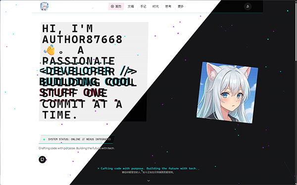

# Cyber

> [!IMPORTANT]
> **Cyber 是 [Shiro](https://github.com/Innei/Shiro) 的分支, 不要向原作者报告问题!**
>
> 目前 **Cyber 仅支持 Mix Space Core 版本 == 13.x (API v3)**。

由 [Shiro](https://github.com/Innei/Shiro) 分支而来, 支持了`API v3`并修改了一些东西使它更酷。

一个有点酷的个人网站主题。

专为 [Mix Space](https://github.com/mx-space) 生态系统设计的现代化个人站点前端。

## :sparkles: 示例站点

以下是一些使用 Cyber 主题的站点：

- [竹かさ雨](https://blog.star-dust.link)

欢迎体验 Cyber 带来的赛博炫酷！

## :rocket: 核心特性

- **:zap: 极致性能**：在 LightHouse 测试中表现卓越，Performance 和 Best Practice 均超过 90%
- **:art: 现代设计**：简洁而不简单的用户界面，提供流畅优雅的用户体验
- **:gem: 细节至上**：采用符合物理学的 Spring 弹性动画，每一帧都如自然般舒适
- **:bell: 实时通知**：通过 WebSocket 连接，访客可实时接收最新文章推送
- **:computer: 活动状态**：结合 [ProcessReporter](https://github.com/Innei/ProcessReporter)，在主页展示实时活动状态
- **:pencil: 扩展语法**：支持丰富的 Markdown 扩展语法，满足多样化写作需求
- **:house: 精美首页**：Hero 区域、活动流、时间线展示、风向标导航
- **:bulb: 思考系统**：独立的思考（Recently）页面，支持评论、点赞、RSS Feed
- **:clock3: 时间线**：按年份、类型筛选的文章/手记时间线
- **:globe_with_meridians: 多语言**：基于 next-intl 的国际化支持

## :gear: 技术架构

基于现代化的前端技术栈构建：

- **NextJS 16** (App Router) - React 全栈框架
- **Jotai** - 原子化状态管理
- **Motion** - 流畅动画库
- **Radix UI** - 无障碍组件库
- **Socket.IO** - 实时通信
- **TailwindCSS v4** - 原子化 CSS 框架
- **DaisyUI v5** - 组件库
- **TanStack Query** - 服务端状态管理

## 📖 部署指南

详细的部署教程请参考：暂时没有

## :camera: 界面预览

## :whale: 快速开始

#### Vercel 一键部署

[](https://vercel.com/new/clone?repository-url=https%3A%2F%2Fgithub.com%2FAt87668%2FCyber&env=AUTH_SECRET,ADMIN_EMAIL&envDescription=You%20need%20to%20fill%20in%20these%20environment%20variables%20for%20the%20program%20to%20work.&envLink=https%3A%2F%2Fgithub.com%2FAt87668%2FNextWebUI%2Fblob%2Fmain%2F.env.example&project-name=nextwebui&repository-name=nextwebui-cloned&products=%5B%7B%22type%22%3A%22integration%22%2C%22protocol%22%3A%22storage%22%2C%22productSlug%22%3A%22neon%22%2C%22integrationSlug%22%3A%22neon%22%7D%2C%7B%22type%22%3A%22blob%22%7D%5D&integration-ids=oac_4nMvFhFSbAGAK6MU5mUFFILs)

## :memo: Markdown 扩展

了解更多 Markdown 扩展语法，请访问：https://shiro.innei.in/#/markdown

## :heart: 致谢与许可

**© 2026 Innei**

**© 2026 Author87668**

- 本项目采用 AGPLv3 许可证，并附加特定的商业使用条件。

使用本项目需要遵循 [附加条款和条件](ADDITIONAL_TERMS.md)。
